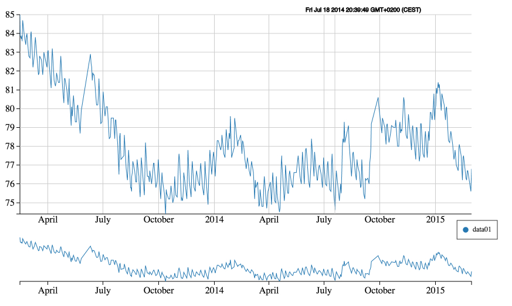
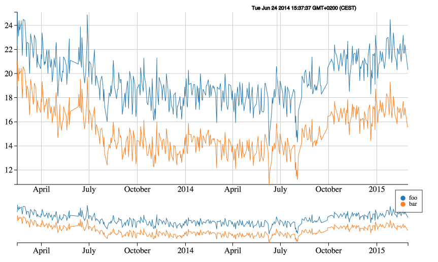

# D3 Line Chart with JSON input

Simple D3 template to visualise data inside a json file as a line chart
  - one or more datasets inside the json file
  - legend
  - zoom area

## Installation

  - Clone the repository
  - don't for get to update the submodule to get d3 ("git submodule update")
  - put the file into a webserver ("python -m SimpleHTTPServer" is enough
  - open the URL in your browser

## Usage

  - You can change the datasource inside the source (var dataset = ... 'url': "filename")
  - It is not required to use a local file. You can use a external file. Instead of filename you can use http://example.com/data.json
  - The file can be created dynamically. You can generate the json output though php for example (http://example.com/json-output.php?filter=foo)
  - The time format for the dates must be specified in the source to match the data (var parseDate = ...)

##Screenshots:
  

